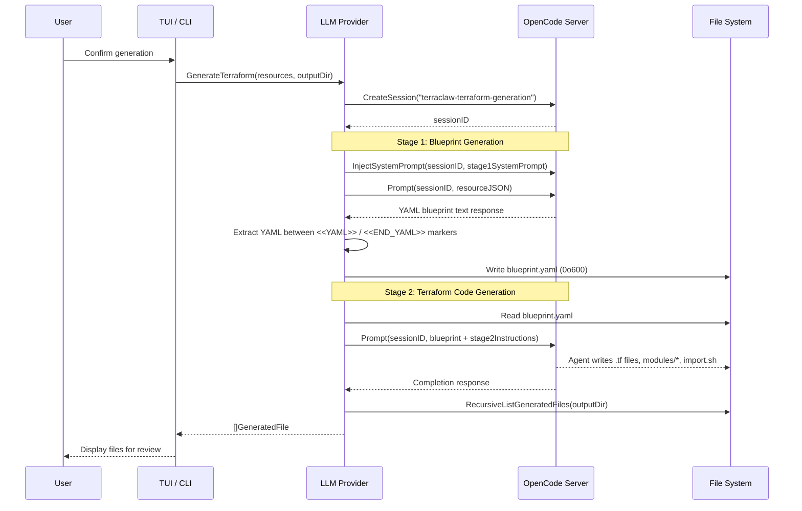

# Design Document: Multi-Stage Terraform Generation

## Overview

This design replaces terraclaw's single monolithic OpenCode prompt with a two-stage pipeline executed within a single OpenCode session. The key insight is that resource analysis (what modules to create, how to group resources, what variables to expose) is a fundamentally different task from code generation (writing syntactically correct HCL). Separating these concerns into two sequential prompts within one session improves reliability and debuggability while preserving conversational context.

The pipeline flow:

1. **Stage 1 (Blueprint)**: `InjectSystemPrompt` sets the blueprint generator identity → `Prompt` sends Resource JSON → agent responds with a structured YAML blueprint
2. **Stage 2 (Terraform)**: `Prompt` sends the persisted blueprint + Terraform generation instructions → agent writes `.tf` files, `import.sh`, and module directories to disk

Both stages share a single `CreateSession` call, so Stage 2 has full context of Stage 1's analysis.

### Design Rationale

- **Single session, two prompts**: Reuses OpenCode's conversational memory. Stage 2 can reference Stage 1's reasoning without re-sending all resource data.
- **YAML blueprint as intermediate artifact**: A human-readable, diffable specification that can be inspected, version-controlled, or re-fed into Stage 2 independently.
- **Persisted blueprint**: Writing `blueprint.yaml` to disk before Stage 2 ensures the file is the source of truth and enables re-running Stage 2 without Stage 1.
- **Backward-compatible file scanning**: Recursive scanning supports the new `modules/*/` directory structure while still finding flat `.tf` files.

## Architecture



### Component Interaction

The pipeline is orchestrated by `OpencodeProvider.GenerateTerraform()` in `internal/llm/provider.go`. The TUI and CLI both call this method. The TUI uses `PromptAsync` for non-blocking operation with progress polling; the CLI uses synchronous `Prompt` calls with a ticker-based status poller.

## Components and Interfaces

### Modified: `internal/llm/provider.go`

The `OpencodeProvider` is refactored to orchestrate the two-stage pipeline.

```go
// Provider is the interface for Terraform code generation.
type Provider interface {
    GenerateTerraform(ctx context.Context, resources []steampipe.Resource, outputDir string) ([]GeneratedFile, error)
    Name() string
}
```

New exported functions:

```go
// BuildStage1SystemPrompt returns the system prompt that sets the blueprint
// generator identity and output format rules.
func BuildStage1SystemPrompt() string

// BuildStage1UserPrompt constructs the Stage 1 user prompt containing
// the resource JSON for blueprint generation.
func BuildStage1UserPrompt(resources []steampipe.Resource) string

// BuildStage2Prompt constructs the Stage 2 prompt containing the persisted
// blueprint content and Terraform generation instructions.
func BuildStage2Prompt(blueprint string, outputDir string) string

// ExtractBlueprint extracts the YAML content between <<YAML>> and <<END_YAML>>
// markers from the Stage 1 response text.
func ExtractBlueprint(response string) (string, error)

// PersistBlueprint writes the blueprint YAML to blueprint.yaml in outputDir
// with 0o600 permissions.
func PersistBlueprint(blueprint string, outputDir string) error

// ReadBlueprint reads the persisted blueprint.yaml from outputDir.
func ReadBlueprint(outputDir string) (string, error)

// RecursiveListGeneratedFiles scans outputDir recursively for .tf, .sh,
// and .yaml files, returning them with relative paths.
func RecursiveListGeneratedFiles(dir string) ([]GeneratedFile, error)
```

The existing `BuildSystemPrompt` and `buildPrompt` functions are replaced by the stage-specific builders. `ListGeneratedFiles` is replaced by `RecursiveListGeneratedFiles`.

### Modified: `OpencodeProvider.GenerateTerraform()`

The method is refactored from a single prompt to a two-stage pipeline:

```go
func (p *OpencodeProvider) GenerateTerraform(ctx context.Context, resources []steampipe.Resource, outputDir string) ([]GeneratedFile, error) {
    // 1. Create session
    sessionID, err := p.server.CreateSession("terraclaw-terraform-generation")

    // 2. Stage 1: Blueprint
    p.server.InjectSystemPrompt(sessionID, BuildStage1SystemPrompt())
    response, err := p.server.Prompt(sessionID, BuildStage1UserPrompt(resources))
    blueprint, err := ExtractBlueprint(response)
    PersistBlueprint(blueprint, outputDir)

    // 3. Stage 2: Terraform
    blueprintFromDisk, err := ReadBlueprint(outputDir)
    response, err = p.server.Prompt(sessionID, BuildStage2Prompt(blueprintFromDisk, outputDir))

    // 4. Scan files recursively
    return RecursiveListGeneratedFiles(outputDir)
}
```

### Modified: `internal/tui/commands.go`

The `generateCodeCmd` is updated to run the two-stage pipeline with stage-aware progress reporting.

New message types:

```go
// stageTransitionMsg signals the TUI to update the stage display.
type stageTransitionMsg struct {
    stage int // 1 or 2
}
```

The `generateCodeCmd` function is refactored to:
1. Create session
2. Inject Stage 1 system prompt
3. Send Stage 1 prompt async, return `generatingStartedMsg` with stage=1
4. On Stage 1 completion (detected in `pollAgentStatusCmd`), extract and persist blueprint, send Stage 2 prompt async, emit `stageTransitionMsg{stage: 2}`
5. On Stage 2 completion, scan files recursively and emit `generationDoneMsg`

### Modified: `internal/tui/model.go`

New fields on `Model`:

```go
type Model struct {
    // ... existing fields ...

    // Pipeline stage tracking (1 = blueprint, 2 = terraform).
    generationStage int

    // Blueprint text from Stage 1 (transient, used during generation).
    blueprintText string
}
```

The `generatingView()` method is updated to show "Stage 1: Generating Blueprint..." or "Stage 2: Generating Terraform Code..." based on `generationStage`.

### Modified: `cmd/generate.go`

The `runGenerate` function is updated to use the two-stage pipeline with stage-specific progress messages printed to stdout.

### Modified: `GeneratedFile` struct

```go
type GeneratedFile struct {
    Path    string // absolute path on disk
    Name    string // relative path from outputDir (e.g. "modules/vpc/main.tf")
    Content string // file content
}
```

The `Name` field changes from basename-only to relative path to support the modular directory structure.

## Data Models

### Blueprint YAML Schema

The Stage 1 prompt instructs the agent to produce YAML between `<<YAML>>` and `<<END_YAML>>` markers. The blueprint follows this structure:

```yaml
meta:
  generated_by: terraclaw
  timestamp: "2025-01-15T10:30:00Z"
  resource_count: 5

modules:
  - name: iam_role_lambda_exec
    description: "IAM role for Lambda execution"
    resources:
      - type: aws_iam_role
        name: lambda_exec
        import_id: "lambda-exec-role"
        attributes:
          assume_role_policy: "..."
      - type: aws_iam_role_policy_attachment
        name: lambda_basic
        import_id: "lambda-exec-role/arn:aws:iam::aws:policy/service-role/AWSLambdaBasicExecutionRole"
    variables:
      - name: role_name
        type: string
        default: "lambda-exec-role"
    outputs:
      - name: role_arn
        value: "aws_iam_role.lambda_exec.arn"

  - name: s3_bucket_data
    description: "S3 bucket for application data"
    resources:
      - type: aws_s3_bucket
        name: data
        import_id: "my-data-bucket"
    variables:
      - name: bucket_name
        type: string
        default: "my-data-bucket"
    outputs:
      - name: bucket_arn
        value: "aws_s3_bucket.data.arn"

root:
  wiring:
    - from: module.iam_role_lambda_exec.role_arn
      to: module.lambda_function.execution_role_arn
  for_each_modules: []  # modules that need for_each at root level
  providers:
    - name: aws
      region: "us-east-1"

imports:
  - address: "module.iam_role_lambda_exec.aws_iam_role.lambda_exec"
    id: "lambda-exec-role"
  - address: "module.s3_bucket_data.aws_s3_bucket.data"
    id: "my-data-bucket"
```

### Resource JSON (Stage 1 Input)

The resource JSON sent to Stage 1 is a JSON serialization of `[]steampipe.Resource`:

```json
[
  {
    "provider": "aws",
    "type": "aws_iam_role",
    "name": "lambda-exec-role",
    "id": "lambda-exec-role",
    "region": "us-east-1",
    "properties": {
      "arn": "arn:aws:iam::123456:role/lambda-exec-role",
      "assume_role_policy": "{...}",
      "...": "..."
    }
  }
]
```

This replaces the current plain-text resource listing with structured JSON for more reliable parsing by the LLM.

### Generated File Structure (Stage 2 Output)

```
output/
├── blueprint.yaml              # Persisted Stage 1 output
├── versions.tf                 # terraform {} block, required_providers
├── providers.tf                # provider "aws" {} config
├── main.tf                     # Root module calls
├── terraform.tfvars            # Default variable values
├── import.sh                   # Static terraform import commands
└── modules/
    ├── iam_role_lambda_exec/
    │   ├── main.tf
    │   ├── variables.tf
    │   └── outputs.tf
    └── s3_bucket_data/
        ├── main.tf
        ├── variables.tf
        └── outputs.tf
```


## Correctness Properties

*A property is a characteristic or behavior that should hold true across all valid executions of a system — essentially, a formal statement about what the system should do. Properties serve as the bridge between human-readable specifications and machine-verifiable correctness guarantees.*

### Property 1: Blueprint extraction round trip

*For any* valid YAML string that does not contain the marker sequences `<<YAML>>` or `<<END_YAML>>`, wrapping it with `<<YAML>>\n` and `\n<<END_YAML>>` markers (with optional surrounding prose text) and then calling `ExtractBlueprint` should return the original YAML string exactly.

**Validates: Requirements 5.1**

### Property 2: Stage 1 error halts pipeline

*For any* error returned by the Stage 1 `Prompt` call (including empty responses), `GenerateTerraform` should return an error and the Stage 2 prompt should never be sent. Specifically, for any `OpencodeProvider` with a mock server that returns an error on the first `Prompt` call, `GenerateTerraform` should return a non-nil error and the mock should record zero subsequent `Prompt` calls.

**Validates: Requirements 1.5**

### Property 3: Stage 2 prompt embeds blueprint content

*For any* non-empty blueprint string and any output directory path, `BuildStage2Prompt(blueprint, outputDir)` should return a string that contains the entire blueprint string as a substring and contains the output directory path as a substring.

**Validates: Requirements 3.1**

### Property 4: Recursive file scanning discovers all matching files

*For any* directory tree containing an arbitrary mix of `.tf`, `.sh`, `.yaml`, and non-matching files at arbitrary nesting depths, `RecursiveListGeneratedFiles` should return exactly the set of `.tf`, `.sh`, and `.yaml` files, and no others.

**Validates: Requirements 8.1, 8.2**

### Property 5: Scanned file names use relative paths

*For any* `GeneratedFile` returned by `RecursiveListGeneratedFiles` where the file resides in a subdirectory, the `Name` field should equal the file's path relative to the scanned root directory (e.g., `modules/vpc/main.tf`), not just the basename.

**Validates: Requirements 8.3**

### Property 6: Stage 1 user prompt contains all resource identifiers

*For any* non-empty list of `steampipe.Resource` values, `BuildStage1UserPrompt(resources)` should produce a string that contains every resource's `ID` and `Type` field as substrings.

**Validates: Requirements 1.3, 2.4**

### Property 7: Blueprint persistence round trip

*For any* valid YAML string, calling `PersistBlueprint(yaml, dir)` followed by `ReadBlueprint(dir)` should return the original YAML string exactly.

**Validates: Requirements 5.1, 5.3**

## Error Handling

### Stage 1 Errors

| Error Condition | Handling |
|---|---|
| `CreateSession` fails | Return error immediately. No prompts sent. |
| `InjectSystemPrompt` fails | Return error immediately. No prompts sent. |
| Stage 1 `Prompt` returns HTTP/network error | Return error. Stage 2 is never invoked. |
| Stage 1 response is empty | Return error (`"stage 1 returned empty response"`). Stage 2 is never invoked. |
| Stage 1 response lacks `<<YAML>>`/`<<END_YAML>>` markers | `ExtractBlueprint` returns error (`"blueprint markers not found in response"`). Stage 2 is never invoked. |
| `PersistBlueprint` fails (disk full, permissions) | Return error. Stage 2 is never invoked. |

### Stage 2 Errors

| Error Condition | Handling |
|---|---|
| `ReadBlueprint` fails | Return error. Stage 2 prompt is not sent. |
| Stage 2 `Prompt` returns HTTP/network error | Return error with context indicating Stage 2 failure. |
| Stage 2 produces zero `.tf` files | Return error (`"stage 2 did not create any .tf files"`). |
| `RecursiveListGeneratedFiles` fails | Return error with wrapped OS error. |

### TUI Error Display

All errors from `GenerateTerraform` are surfaced via `generationDoneMsg{err: ...}` and displayed in the TUI's error style. The TUI remains on the `StepGenerating` step with the error visible, allowing the user to quit or retry.

### CLI Error Display

The `runGenerate` function prints errors to stderr with a descriptive prefix indicating which stage failed (e.g., `"stage 1 (blueprint) failed: ..."` or `"stage 2 (terraform) failed: ..."`).

## Testing Strategy

### Property-Based Testing

Property-based tests use the [`gopter`](https://github.com/leanovate/gopter) library (Go property testing and generation). Each property test runs a minimum of 100 iterations.

| Property | Test Description | Tag |
|---|---|---|
| Property 1 | Generate random YAML strings, wrap in markers with random prose, extract and compare | `Feature: multi-stage-terraform-generation, Property 1: Blueprint extraction round trip` |
| Property 2 | Generate random resource lists, mock server to fail Stage 1, verify no Stage 2 call | `Feature: multi-stage-terraform-generation, Property 2: Stage 1 error halts pipeline` |
| Property 3 | Generate random blueprint strings and output dirs, verify both appear in prompt output | `Feature: multi-stage-terraform-generation, Property 3: Stage 2 prompt embeds blueprint content` |
| Property 4 | Generate random directory trees with mixed file extensions at random depths, verify scan results | `Feature: multi-stage-terraform-generation, Property 4: Recursive file scanning discovers all matching files` |
| Property 5 | Generate files in random subdirectory structures, verify Name field equals relative path | `Feature: multi-stage-terraform-generation, Property 5: Scanned file names use relative paths` |
| Property 6 | Generate random resource lists, verify all IDs and Types appear in prompt | `Feature: multi-stage-terraform-generation, Property 6: Stage 1 user prompt contains all resource identifiers` |
| Property 7 | Generate random YAML strings, persist then read, compare | `Feature: multi-stage-terraform-generation, Property 7: Blueprint persistence round trip` |

### Unit Tests

Unit tests complement property tests by covering specific examples, edge cases, and integration points:

- `TestExtractBlueprint_NoMarkers`: Verify error when markers are missing.
- `TestExtractBlueprint_EmptyYAML`: Verify behavior when markers exist but content between them is empty.
- `TestBuildStage1SystemPrompt_ContainsKeyInstructions`: Verify prompt contains module grouping, for_each, import ID, prompt injection defense, and AWS CLI fallback instructions (Requirements 2.2–2.7).
- `TestBuildStage2Prompt_ContainsKeyInstructions`: Verify prompt contains module directory, import.sh, cross-module reference, and AWS CLI instructions (Requirements 3.2–3.5).
- `TestGenerateTerraform_HappyPath`: Mock server returning valid Stage 1 and Stage 2 responses, verify full pipeline produces files.
- `TestGenerateTerraform_Stage2Error`: Mock server returning success for Stage 1 but error for Stage 2, verify error is returned.
- `TestPersistBlueprint_Permissions`: Verify file is written with 0o600 permissions (Requirement 5.2).
- `TestRecursiveListGeneratedFiles_IgnoresNonMatchingExtensions`: Verify `.txt`, `.json`, etc. are excluded.
- `TestTUI_GeneratingView_Stage1`: Verify view output contains "Stage 1: Generating Blueprint..." when `generationStage == 1` (Requirement 4.1).
- `TestTUI_GeneratingView_Stage2`: Verify view output contains "Stage 2: Generating Terraform Code..." when `generationStage == 2` (Requirement 4.2).
- `TestImportFallback_NoImportScript`: Verify fallback to `GuessResourceAddress` when `import.sh` is absent (Requirement 6.3).

### Test File Organization

```
internal/llm/provider_test.go          # Property + unit tests for prompt builders, extraction, persistence, pipeline
internal/llm/scanner_test.go           # Property + unit tests for RecursiveListGeneratedFiles
internal/tui/model_test.go             # Unit tests for stage display in generatingView
internal/tui/commands_test.go          # Unit tests for two-stage command flow with mocks
```
